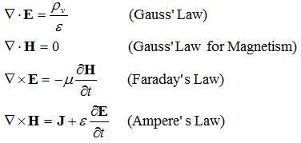

```{r setup, include=FALSE}
knitr::opts_chunk$set(echo = FALSE)
``` 
## Análisis exploratorio y curación de datos

- Mariano Dominguez @ IATE-OAC-UNC & CONICET
- Edgardo Hames @ Bitlogic
- Gabriel Miretti @ Bitlogic


***
## Paradigmas cientificos clasicos:

Siglos atras la ciencia era **empirica**, describiendo los procesos naturales.

{
width=30% }

luego se desarrollaron modelos **teoricos** matematicos, generalizaciones

{
width=30% }

***
## Astronomia (u otra ciencia) Computacional 

En las ultimas decadas se han simulando fenomenos complejos.

{
width=40% 
}

***
## El cuarto paradigma en ciencia:

Hoy en dia la exploracion de datos (eScience) unifica la teoria, los experimentos y las simulaciones.

– Datos capturados por instrumentos o generados por una simulacion.
– Procesados por complejos pipelines de software.
– Cientifico analiza bases de datos utilizando tecnicas estadisticas.

{
width=30% 
}


<http://www.astro.caltech.edu/~george/aybi199/4th_paradigm_book_complete_lr.pdf>

***
## Por que (no) R? es FLOSS!

Introduccion al lenguaje estadistico R <http://r-project.org> y CRAN <http://cran.r-project.org/> :
R consiste en una colleccion de software con una importante variedad de paquetes para analisis de datos,
matematica aplicada, estadistica , graficos y diferentes utilidades.  Los paquetes extras en CRAN son suministrados
por individuos o comunidades de expertos en biologia, economia, geologia y otros campos (ver <https://www.jstatsoft.org/index> ).

Existe una linda IDE: RStudio <https://www.rstudio.com/> y una muy buena biblioteca para graficos  ggplot2 (now ggviz).
Tambien existen diversas galeria de graficos en R y recientemente se ha establecido el consorcio R:
<https://www.r-consortium.org/> (Microsoft compro Revolution, ver tambien h2o).

Se ha realizado un considerable esfuerzo para conectar R con otros programas, lenguajes y sistemas estadisticos. 
Scripts en R pueden correr facilmente desde la consola, pero mas esfuerzo es necesario para correr programas
en otros lenguajes. R se conecta con C, C++, FORTRAN, JaVa, JavaScript, Matlab, Python, Perl, XLisp y Ruby.
En algunos casos, las interfaces son bidireccionales permitiendo el  interambio de variables.
***
## R Markdown

Esta es una presentacion en R Markdown. Markdown es un formato de sintaxis simple para crear documentos HTML, PDF y MS Word. Por mas detalles de comom utilizar R Markdown ver <http://rmarkdown.rstudio.com>.

Cuando se clickea el boton  **Knit**, un documento es generado que incluye el contenido asi como los outputs de 
de los chuncks de codigos R embebidos en el documento ver <https://legacy.gitbook.com/book/bids/the-practice-of-reproducible-research/details> y <https://arxiv.org/abs/1605.04339>. 

**Shiny** is un paquete de R que permite constriur apps interactivos  directamente en R Markdown, webpages o cosntruir dashboards. Ademas se pueden extender los  Shiny apss con temas CSS, htmlwidgets y herramientas de JavaScript <https://shiny.rstudio.com/galley> .

***
## Estadistica con R 

Una nocion basica es la de una muestra aleatoria.

En R es posible simular facilmente esta situacion con la funcion **sample**.
Si por ejemplo quiero elegir cinco numero aleatorios entre 1 y 40, escribo:

```{r  echo=TRUE}
sample(1:40,5)
```

Muestrear con reeemplazo es adecuado para modelar monedas o dados. Por ejemplo para
simular arrojar diez monedas podemos escribir:

```{r  echo=TRUE}
sample(c("H","T"), 10, replace=T)
```

Tambien se puede simular datos con diferentes probabilidades de cada resultado,
(por ejemplo tener una tasa de exitos del 90%) utilizando el argumento prob in sample:

```{r  echo=TRUE}
sample(c("succ", "fail"), 10, replace=T, prob=c(0.9, 0.1))
```

***
## Distribuciones discretas en R:

cuando las variables solo pueden tomar solamente valores finitos, es preferible dibujar un digrama de alfileres (pin), aqui podemos observar la distribucion binomial con n=50 y p=0.33.

```{r  echo=TRUE}
x <- 0:50
plot(x,dbinom(x,size=50,prob=.33),type="h")
```

***
## Numeros Aleatorios:

En general suena contradictorio generar numeros aleatorios en una computadora
dado que se supone que sus resultados son predecibles y reproducibles.
Lo que en realidad es posible es generar secuencias de numeros pseudo-aleatorios, que para 
todos los efectos practicos se comportan como si fueran aleatorios. Ver sobre LCGs,
<http://www.aaronschlegel.com/series/random-number-generation/>


En estadistica se utilizan para crear conjuntos de datos simulados para estudiar
los efectos de los algoritmos. El uso de funciones que generan numeros aleatorios
es simple, por ejemplo numeros que siguen una distribucion normal:

```{r}
n=100
x <- rnorm (n, mean=0, sd=1)
mean(x)
sd(x)
quantile(x)
```

***
### Distribution uniforme

El generador basico en R es runif, cuya entrada es el numero de valores a ser generados.

```{r}
runif(10, min=2, max=5)
```

Veamos como funciona:


```{r}
Nsim=10^4
x=runif(Nsim)
x1=x[-Nsim]
x2=x[-1]
par(mfrow=c(1,3))
hist(x)
plot(x1,x2)
acf(x)
```

***
### Guardando las semillas.

runif no implica aleatoridad per se. runif(Nsim) es calcular una secuencia deterministica
 basada en un numero aleatorio inicial (semilla).


```{r echo=TRUE}
set.seed(1)
runif(5)
set.seed(1)
runif(5)
set.seed(2)
runif(5)
```

```{r}
MC1seed <- .Random.seed # save the generator state
.Random.seed <- MC1seed # restore seed
```

***
### La transformacion Inversa del CDF:

Existe una transformacion simple, que nos permite transformar cualquier variable aleatoria
en una uniforme y mas importante viceversa.

Por ejemplo si $x$ esta dada por una densidad de probabilidad $f$ y una CDF $F$ , entonces vale la relacion: $F(x)=\int_{-\infty}^{x} f(t) \delta t$ y si elegimos $U = F (X)$, con $U$ una 
variable aleatoria distribuida uniformemente.

Ejemplo: Si $X \propto exp$, entonces $F (x) = 1-e^{-x}$ . Resolviendo para $x$ en $u = 1-e^{-x}$
nos da $x = -log(1 - u)$. Por lo tanto si $u$ es uniforme, entonces $X \propto exp$

```{r}
Nsim=10^4
#number of random variables
U=runif(Nsim)
X=-log(U)
#transforms of uniforms
Y=rexp(Nsim)
#exponentials from R
par(mfrow=c(1,2))
#plots
hist(X,freq=F,main="Exp from Uniform")
hist(Y,freq=F,main="Exp from R")
```


***
## Submuestras

Los comandos subset(), which() and ifelse() son probablemente los mas utilizados en R.
Una manera de filtrar elementos de un vector es utilizar la funcion subset().

```{r echo=TRUE}
# create a vector
x <- c(5,4:8,12)
x
y <- subset(x, x < 6)
y
```

***
## Utilizando which() 

identifica la posicion del vector donde se cumple (is TRUE) la condicion: 
Vea el siguiente ejemplo de como utilizarla:

```{r echo=TRUE}
# create a vector
z <- c(6:10, 12, -3)
z
which(z > 8)
```
***
## Utilizando ifelse 

el comando ifelse tiene dos opciones para ejecutar. Si la condicion es TRUE se ejecuta la primera, si la condicion es FALSE se ejecuta la segunda. La sintaxis es ifelse(condition, opcion1, opcion2). Un ejemplo a continuacion.

```{r echo=TRUE}
# create a vector
x <- c(-2, 5:10, 15)
x
# if values are < 7 will code those 1, else will become 0
ifelse(x < 7, 1, 0)
# also you can do this
ifelse(x < 7, 1, x)
```

***
## Code the Matrix 1:

Creamos una matriz x con numeros provenientes de una funcion normal.
y llamamos a sus elementos con x[fila,columna]. 

```{r echo=TRUE}
# matrix with 12 random numbers in 4 rows
x <- matrix(rnorm(12), nrow=4)
x 
# find the number in 3rd row and 2nd column
x[3,2]
```

***
## Code the Matrix 2:

tambien es posible referirse a una columna o fila u obtener las dimensiones.

```{r echo=TRUE}
# show second column
x[,2]
# show forth row
x[4,]
# find number or columns and rows in matrix
dim(x)
```


***
### Utilizando lazos en R:

Cada vez que alguna operacion debe ser repetida un lazo resulta util.
De acuerdo al manual de R, entre los comandos basicos de control de flujo,
las construcciones para lazos son: fort, while y repeat, con las clausulas 
adicionales break y next.

```{r}
?Control
```

Un ejemplo de un lazo simple:

```{r}
u1 <- rnorm(30) # create a vector filled with random normal values
print("This loop calculates the square of the first 10 elements of
vector u1")
usq<-0
for(i in 1:10){
usq[i]<-u1[i]*u1[i] # i-th element of u1 squared into i-th position
print(usq[i])
}
print(i)
```

Por lo que el bloque del lazo es contenido por {}.

***
### Lazos anidados

Supongamos que queremos manipular una matriz poniendo sus elementos con valores especificos:

```{r}
# nested for: multiplication table
mymat = matrix(nrow=30, ncol=30) # create a 30 x 30 matrix 
for(i in 1:dim(mymat)[1]){
   # for each row
   for(j in 1:dim(mymat)[2]){
      # for each column
      # assign values based on position: product of two indexes
      mymat[i,j] = i*j 
   }
}
mymat[1:10,1:10] # show just the upper left 10x10 chunk
```

***
### Vectorizacion 1:

es la operacion de convertir repetidas operaciones en numeros (escalares) en operaciones
en vectores o matrices. Muchos lazos pueden hacerse implicitos con vectorizacion.

el ejemplo mas elemental es la adicion de dos vectores v1 y v2 en un vector v3, lo que puede
hacerse elemento por elemento con un lazo:

```{r echo=TRUE}
n=100
v1 <- rnorm(n)
v2 <- rnorm(n)  
v3 <- 0
#  
for (i in 1:n){
v3[i] <-v1[i] + v2[i]
}
v3
```

***
### Vectorizacion 2:

o utilizando la forma vectorizada:

```{r echo=TRUE}
v3 = v1 + v2
v3
```

lo que permite utilizar eficientemente rutinas muy eficientes de algebra lineal
(BLAS)

Comparemos el tiempo de ejecucion entre ambas soluciones: 

```{r echo=TRUE}
m=10; n=10;
mymat<-replicate(m, rnorm(n)) # create matrix of normal random numbers
mydframe=data.frame(mymat) # transform into data frame
# measure loop execution
system.time(
  for (i in 1:m) {
    for (j in 1:n) {
      mydframe[i,j]<-mydframe[i,j] + 10*sin(0.75*pi)
    }
  }
)
```
Ejercicio: Mida el tiempo en una version vectorizada.

```{r}
m2=10; n2=10;
mymat2<-replicate(m2, rnorm(n2)) # create matrix of normal random numbers
mydframe2=data.frame(mymat2) # transform into data frame
# measure loop execution
system.time(
  mydframe2<-mydframe2 + 10*sin(0.75*pi)
)
```

***
### La familia de instrucciones apply.

Esta compuesta de funciones intrinsecamente vectorizada y esta compuesta de funciones
([s,l,m,r,t,v]apply) para manipular datos en forma de matrices en una forma repetitiva,
evitando el uso explicito de lazos. Las primeras tres son las mas utilizadas:

1. apply permite aplicar una funcion a filas (primer indice) o columnas (segundo indice) de una matriz.

2. lapply permite aplicar una dada funcion a cada elemento de una lista.

3. sapply igual que la anterior, pero se obtiene un  vector en lugar de una lista.

***

```{r echo=TRUE}
#### elementary example of apply function
# define matrix mymat by replicating the sequence 1:5 for 4 times and transforming into a matrix
mymat<-matrix(rep(seq(5), 4), ncol = 5)
# mymat sum on rows
apply(mymat, 1, sum)
# mymat sum on columns
apply(mymat, 2, sum)
# produce a summary column wise (for each column)
apply(mymat, 2, function(x, y) summary(mymat))
```

***
## Importando y exportando datos.

Los datos en R pueden guardarse como archivos .Rdata con la funcion save.
Que luego pueden leerse en R con load.


```{r echo=TRUE}
a <- 1:10
save(a, file = "Data.Rdata")
rm(a)
load("Data.Rdata")
print(a)
```

***
## Presentando los Data Frames:

El siguiente ejemplo crea un dataframe a y lo guarda como un archivo CSV con 
"write.cvs()". Luego el dataframe es cargado desde el archivo a una variable b con "read.cvs()".


```{r echo=TRUE}
var1 <- 1:5
var2 <- (1:5) / 10
var3 <- c("Diplo", "Datos", "en", "FaMAF", "@UNC")
a <- data.frame(var1, var2, var3)
names(a) <- c("VariableInt", "VariableReal", "VariableChar")
write.csv(a, "Data.csv", row.names = FALSE)
 #rm(a)
b <- read.csv("Data.csv")
print(b)
```
***
## Creando un Data Frame

Un data frame es similar a una matriz, pero puede contener elementos numericos o texto.
La funcion que se utiliza para crear data frames es dataframe() por ej:

```{r echo=TRUE}
# create a data frame
hospital <- c("Cordoba", "Buenos Aires")
pacientes <- c(150, 350)
df <- data.frame(hospital, pacientes)
df
# structure
str(df)
```

***
## Read Write Table

La funcion write.table guarda el contenido de un objeto en un archivo. El objeto es
tıpicamente un marco de datos (’data.frame’), pero puede ser cualquier otro tipo de objeto
(vector, matriz,. . . ).

```{r}
write.table(df,file="data.dat")  
``` 
La funcion read.table crea un marco de datos (’data frame’) y constituye la manera mas
usual de leer datos en forma tabular.

```{r echo=TRUE}
misdatos <- read.table("data.dat")
misdatos$hospital
misdatos["hospital"]
```
crea un marco de datos denominado misdatos

***
cada variable recibira por defecto el nombre V1, V2,... y puede ser accedida individualmente
escribiendo misdatos$V1, misdatos$V2,... , o escribiendo misdatos["V1"], misdatos["V2"],...
, o, tambien escribiendo misdatos[,1], misdatos[,2 ], .. etc

Existen varias opciones con valores por defecto (aquellos usados por
R si son omitidos por el usuario). Para solicitar ayuda utilizar ?

```{r echo=TRUE}
?read.table
```

Para mas ejemplos de uso de R puede consultarse <https://www.computerworld.com/article/2497464/business-intelligence/top-r-language-resources-to-improve-your-data-skills.html> en particular es muy recomendable el paquete <http://swirlstats.com/>

Para extender el manejo de R ver <http://adv-r.had.co.nz/>  y como construir paquetes
<http://r-pkgs.had.co.nz/> y por supuesto <www.r-graph-gallery.com>


***
## coffe & mate breack?

***
##  Algunos Datasets intrinsecos:

iris dataset
```{r}
str(iris)
```
bodyfat dataset, brief excursion to install.packages("") details:
```{r}
library(mboost)
data("bodyfat", package="TH.data")
str(bodyfat)
head(bodyfat)
```

***
## Exploracion de Datos 1: 
  
  
 * 1-Checkeando las dimensiones
```{r echo=TRUE}
dim(iris)
```
 * 2 nombre de las variable o columnas
```{r echo=TRUE}
names(iris)
```
 * 3 Estructura
```{r echo=TRUE}
str(iris)
```


***
## Exploracion de Datos 2:

 * 4 Atributos
```{r echo=TRUE}
attributes(iris)
```
 
***
## Exploracion de Datos 3: 

  * 5 Veamos las primeras 5 filas
```{r echo=TRUE}
iris[1:5,]
```
  * 6 Veamos los valores de alguna columna
```{r echo=TRUE}
iris[1:10, "Sepal.Length"]
```

***
## Imputacion de valores NA 1:

```{r echo=TRUE}
# Introduce missing values
set.seed(100)
original<-iris
iris[sample(1:nrow(iris), 40), "Sepal.Length"] <- NA
library(mice)
md.pattern(iris)
```

***
## Imputacion de valores NA 2:


Esto puede visualizarse como
```{r echo=TRUE}
library(VIM)
aggr_plot <- aggr(iris, col=c('navyblue','red'), numbers=TRUE, sortVars=TRUE, labels=names(iris), cex.axis=.7, gap=3, ylab=c("Histogram #of missing data","Pattern"))
```

***
## Imputacion de valores NA 3:

Para tratar con valores perdidos, el metodo principal es imputar esos valores por ejemplo con la media, mediana, moda o valores cercanos. Otra opcion si se disponen de suficientes datos es ignorar esa medicion (na.action=na.omit)

```{r echo=TRUE}
library(Hmisc)
impute(iris$Sepal.Length, mean)  # replace with mean
```


***
## Exploracion de variables individuales 1:

 * 1 Distribucion de cada variable
```{r echo=TRUE}
iris<-original
summary(iris)
```

***
## Exploracion de variables individuales 2:

  * 2 Frecuencia
```{r echo=TRUE}
table(iris$Species)
```
  * 3 Pie chart
```{r echo=TRUE}
pie(table(iris$Species))
```

***
## Exploracion de variables individuales 3:

  * 4 media y varianza de la Sepal.Length
```{r echo=TRUE}
mean(iris$Sepal.Length)
var(iris$Sepal.Length)
```

***
## Exploracion de variables individuales 4:

  * 5 Histogramas
```{r echo=TRUE}
hist(iris$Sepal.Length)
```

***
## Exploracion de variables individuales 5:
  * 6 Densidad
```{r echo=TRUE}
plot(density(iris$Sepal.Length))
```


***
## Errores como features:

El vocabulario internacional de metrologia (VIM) define una cantidad como **una propiedad de 
un fenomeno, cuerpo o substancia, donde la propiedad tiene una magnitud que puede ser expresada
como un numero y una referencia**.

donde tipicamente el numero es el **valor de una cantidad** obtenida mediante un procedimiento de
medicion, y la referencia es la **unidad de medicion**.

Adicionalmente, toda cantidad debe tener asociada alguna indicacion sobre la calidad de la medicion,
esto es un atributo cuantificable conocido como **incerteza o error**, que caracteriza que dispersion de
valores que pueden ser atribuibles a una dada medicion.

Las incertezas pueden ser directamente medidas o derivadas en el caso de una medicion indirecta 
(Potencia=Voltaje*corriente) y deben obtenerse por propagacion. Ver las librerias units y errors en CRAN,
para un uso adecuado de las mismas como features o cuando se generan nuevos.

***
## Explorando multiples variables 1:


* 1 covariance of two variables
```{r echo=TRUE}
cov(iris$Sepal.Length, iris$Petal.Length)
```
* 2 Correlation of two variables
```{r echo=TRUE}
cor(iris$Sepal.Length, iris$Petal.Length)
```

***
## Explorando multiples variables 2:
* 3 Distribution in subsets
```{r echo=TRUE}
aggregate(Sepal.Length ~ Species, summary, data=iris)
```


***
## Explorando multiples variables 3:
* 4 Box Plot
```{r echo=TRUE}
boxplot(Sepal.Length~Species, data=iris)
```

***
## Explorando multiples variables 4:
* 5 Scatter plot
```{r echo=TRUE}
plot(iris$Sepal.Length, iris$Sepal.Width)
```

***
## Explorando multiples variables 5:
* 6 Pairs plot
```{r echo=TRUE}
pairs(iris)
```

***
## Explorando multiples variables 6:
* 7 other complicated plots
```{r echo=TRUE}
library(lattice)
splom(~iris[1:3] | Species, data = iris, pscales = 0,varnames = c("Sepal\nLength", "Sepal\nWidth", "Petal\nLength"))
```

***
## Explorando multiples variables 7:
```{r echo=TRUE}
parallelplot(~iris[, 1:4] | Species, data = iris, layout = c(3, 1))
```
***
## More Exploration

* 3D Scatter plot
```{r echo=TRUE}
library(scatterplot3d)
scatterplot3d(iris$Petal.Width, iris$Sepal.Length, iris$Sepal.Width)
```

***
## More Exploration

* Level Plot
```{r echo=TRUE}
library(lattice)
print(levelplot(Petal.Width~Sepal.Length*Sepal.Width, iris, cuts=9, col.regions=grey.colors(10)))
```

***
## More Exploration

* Contour
```{r echo=TRUE}
filled.contour(volcano, color = terrain.colors, asp = 1, plot.axes=contour(volcano, add=T) )
```

***
## More Exploration

* 3D Surface
```{r echo=TRUE}
persp(volcano, theta = 25, phi = 30, expand = 0.5, col = "lightblue")
```

***
## More Exploration

#* Interactive 3D Scatter Plot
#```{r echo=TRUE}
#library(rgl)
#plot3d(iris$Petal.Width, iris$Sepal.Length, iris$Sepal.Width)
#```

***
## Writing plots as pdf/ps.

* Save as a .PDF file
```{r echo=TRUE}
pdf("myPlot.pdf")
x <- 1:50
plot(x, log(x))
graphics.off()
```

* Save as a postscript file
```{r echo=TRUE}
postscript("myPlot.ps")
x <- -20:20
plot(x, x^2)
graphics.off()
```

***
## Writing plots as png/jpeg

* Find temp.. or save as png or jpg
```{r echo=TRUE}
jpeg("plot.jpg")
plot(x, 1/x)
dev.off()
```


***
## Ejercicios:

Visualizacion es una herramienta muy importante para la generacion de intuicion, pero
raramente uno tiene los datos en la forma necesaria. Frecuentemente se necesitara 
crear nuevas variables o simplemente reordenarlas.

Exploraremos ahora la manipulacion basica utilizando un conjunto de datos sobre los
vuelos en Nueva York en 2013.

```{r echo=TRUE}
library(nycflights13)
fligths<-nycflights13::flights
fligths
```

***
## Practico 1: Entregar un Rmd donde se encuentren todos los vuelos que:

1 - Que arribaron con un retraso de mas de dos horas.
2 - Volaron hacia Houston (IAH o HOU)
3 - Fueron operados por United, American o Delta.
4 - Salieron en Verano (Julio, Agosto y Septiembre)
5 - Arrivaron mas de dos horas tarde, pero salieron bien.
6 - Salieron entre medianoche y las 6 am.

***

1 - Que arribaron con un retraso de más de 2 horas. 

En el dataset, la columna de retraso en el arribo es __arr_delay__, la cual se encuentra en minutos. Por lo tanto 2 horas corresponden a 2 veces 60 minutos:

* La variable __cuenta_tiempo__ es una tabla donde se indica la cuenta de cuantos vuelos cumplen con el requisito definido y también la cuenta de aquellos vuelos que no la cumplen. Por lo tanto, en dicha tabla, la respuesta que buscamos es aquella cuenta que cumple con nuestra consigna, entonces es aquella con valor lógico __TRUE__=10034.
* Además, a modo de agregado se muestra la tabla completa de vuelos, pero filtrada para aquellos que cumplen con nuestro requisito.

```{r echo=TRUE}
library(dplyr)
tiempo_de_arribo <- group_by(flights, arr_delay > 2*60)
cuenta_tiempo <- summarise(tiempo_de_arribo, count = n())
#Tabla con el detalle
cuenta_tiempo

#Tabla filtrada
filter(flights, arr_delay > 2*60)
```
***

2 - Volaron hacia Houston (IAH o HOU)

De la misma manera, que en punto anterior, se muestran 2 tablas, la primera con las cuentas de quienes cumplen y quienes no con la consigna y en segundo lugar, la tabla completa pero filtrando sólo los vuelos que cumplen con el requisito definido.

* Por lo tanto, volaron hacia Houston 9313 vuelos.

```{r echo=TRUE}
library(dplyr)
houston <- group_by(flights, dest == "IAH" | dest == "HOU")
cuenta_houston <- summarise(houston, count = n())
#Tabla con el detalle
cuenta_houston

#Tabla filtrada
filter(flights, dest == "IAH" | dest == "HOU")
```
***

3 - Fueron operados por United, American o Delta.

* Fueron operados un total de 139504 vuelos.

```{r echo=TRUE}
library(dplyr)
operados <- group_by(flights, carrier == "UA" | carrier == "AA" | carrier == "DL")
cuenta_operados <- summarise(operados, count = n())
#Tabla con el detalle
cuenta_operados

#Tabla filtrada
filter(flights, carrier == "UA" | carrier == "AA" | carrier == "DL")
```
***

4 - Salieron en Verano (Julio, Agosto y Septiembre)

Los meses se encuentran definidos por valores numéricos enteros del 1 al 12, correspondiente al mes, por ejemplo: enero es 1, febrero es 2, etc.

* Los vuelos que salieron en verano fueron 86326.

```{r echo=TRUE}
library(dplyr)
verano <- group_by(flights, month == 7 | month == 8 | month == 9)
cuenta_verano <- summarise(verano, count = n())
#Tabla con el detalle
cuenta_verano

#Tabla filtrada
filter(flights, month == 7 | month == 8 | month == 9)
```
***

5 - Arribaron más de dos horas tarde, pero salieron bien.

Nuevamente, las demoras de arribo y partida están definidas en minutos, por lo tanto buscamos filtrar los vuelos para las condiciones de demora de arribo de más de 120 minutos y sin demora de partida, o lo que es lo mismo, una demora menor a 0 minutos.
 
* La cantida de vuelos que cumplen con esa condición es de 29.

```{r echo=TRUE}
library(dplyr)
tarde_pero_bien <- group_by(flights, arr_delay > 2*60 & dep_delay <= 0)
cuenta_tarde_pero_bien <- summarise(tarde_pero_bien, count = n())
#Tabla con el detalle
cuenta_tarde_pero_bien

#Tabla filtrada
filter(flights, arr_delay > 2*60 & dep_delay <= 0)
```
***

6 - Salieron entre medianoche y las 6 am.

Aquí los horarios se encuentran definidos en cantidad de minutos, por ejemplo: las 3 AM corresponden a las 0300, las 18 PM a las 1800, etc.

* El total de vuelos que cumlen dicha condición es de 1954.
```{r echo=TRUE}
library(dplyr)
medianoche <- group_by(flights, sched_dep_time >= 0000 & sched_dep_time < 0600)
cuenta_medianoche <- summarise(medianoche, count = n())
#Tabla con el detalle
cuenta_medianoche

#Tabla filtrada
filter(flights, sched_dep_time >= 0000 & sched_dep_time < 0600)
```