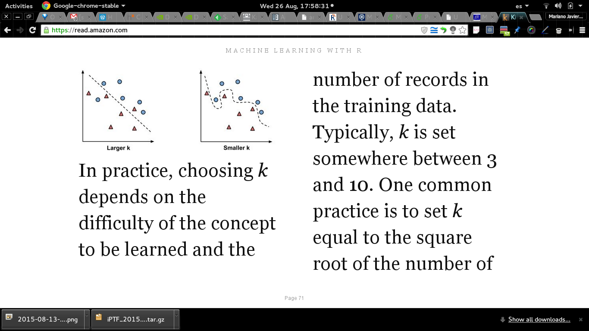
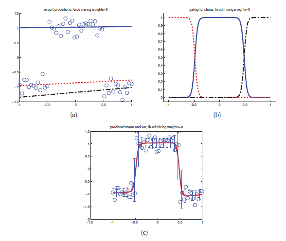
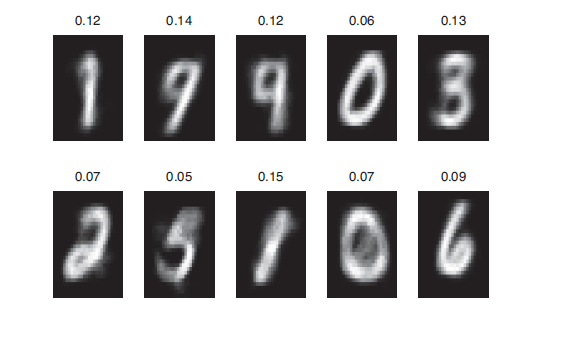

```{r setup, include=FALSE}
knitr::opts_chunk$set(echo = FALSE)
```

## Análisis exploratorio y curación de datos

- Mariano Dominguez @ IATE-OAC-UNC & CONICET
- Edgardo Hames @ Bitlogic
- Gabriel Miretti @ Bitlogic


***
### Un breve vistazo de Aprendizaje supervisado

* Tenemos un conjunto de variables medidas que las llamaremos  **inputs**. Estas tienen alguna influencia en una o mas variables que llamaremos **outputs**. La **meta** es utilizar los inputs **para predecir** los valores de los outputs.

* En la literatura estadistica los inputs son frecuentemente llamados como **predictores**, un termino que puede usarse equivalentemente a inputs, y mas clasicamente seran las **variables independientes**.

* En la literatura de reconocimiento de patrones se prefiere el termino **features** . Los outputs son llamados tambien las **respuestas**, o  clasicamente las **variables dependientes**.

****
### Modelos Lineales y Cuadrados minimos

Los modelos lineales son una de las herramientas estadisticas mas importantes. Dado un vector de inputs  $X^{T}=(X_{1}, X_{2}, ..., X_{p})$, se puede predecir el  output $Y$ via el siguiente modelo:
 $\hat{Y} = \hat{ \beta_{0} } + \sum_{j=1}^{p} X_{j} \hat{ \beta_{j}}$

$\hat{\beta_{0}}$ es la ordenada al origen, tambien conocida como el **bias** en aprendizaje automatico (machine learning). A menudo es conveniente incluir la variable constante 1 en $X$, y de manera similar $\hat{\beta_{0}}$ en el vector de coeficientes $\hat{\beta}$, y entonces escribir el modelo lineal en forma de un producto interno vectorial: $\hat{Y}=X^{T}\hat{\beta}$.

Especificar modelos estadisticos como  regresion es muy simple en R.
Simplemente escribiendo "y ~ model", donde "y" sera la variable de respuesta y model seran todos los predictores a ser incluidos en el modelo. Para la regresion lineal utilizaremos la funcion lm.

*** 
### Una simple Regresion Lineal 1:

Utilizaremos un conjunto de datos de  92 estrellas del grupo de las Hyades las cuales filtraremos por coordenadas y errores de medicion en la paralaje.

```{r echo=TRUE}
loc <- "http://astrostatistics.psu.edu/datasets/"
hip <- read.table(paste(loc,"HIP_star.dat",sep=""),
header=T,fill=T)
attach(hip)
filter1 <- (RA>50 & RA<100 & DE>0 & DE<25)
filter2 <- (pmRA>90 & pmRA<130 & pmDE>-60 & pmDE< -10)
filter <- filter1 & filter2 & (e_Plx<5)
sum(filter)
```

*** 
### Una simple Regresion Lineal 2:

Un breve ejemplo de una regresion linear entre $B-V$ y $\log(L)$.

```{r echo=TRUE}
mainseqhyades <- filter & (Vmag>4 | B.V<0.2)
logL <- (15-Vmag-5 * log10(Plx)) / 2.5
x <- logL[mainseqhyades]
y <- B.V[mainseqhyades]
regline <- lm(y~x)
summary(regline)
```


*** 
### Una simple Regresion Lineal 3:

```{r echo=TRUE}
plot(x,y)
abline(regline,lwd=2,col=2)
points(mean(x),mean(y),col=3,pch=20,cex=3)
```

*** 
### Representaciones

Aqui nos preguntamos algo comunmente pasado por alto; esto es que si los datos
son mejor analizados en la forma en la cual vienen dados (hint:
la respuesta es frecuentemente NO, vease el ejemplo anterior).

Esta es una pregunta sobre **representaciones** cual es la mejor forma de
analizar los datos de forma de resaltar los features de interes?

La **meta final** seria cocinar el un conjunto cualquiera de mediciones 
a un conjunto menor pero mas independiente, liberando asi al analisis
posterior (el ML) de tener que redescubrir sus redundancias.

Una buena representacion nos puede llevar a muy lejos en resolver un problema dificil, como una mala puede condenar un esfuerzo bien intencionado.

***
### Transformadas ortogonales 1:

Estas son simples de deshacer, esto es importante por que no queremos que
nuestras transformaciones de los datos tiren informacion.

Una  matriz es ortogonal si su inversa es igual a su transpuesta: $$M^T . M = I$$ donde la matriz transpuesta se define por $$M_{ij}^{T} = M_{ji}$$ e $$I$$ es la matriz identidad con unos en la diagonal y zeros en todas las otras componentes.

La multiplicacion de una matriz ortogonal por un vector de datos define 
una transformacion ortogonal de un vector. 

***
### Transformadas ortogonales 2:

Para una matriz compleja la matriz **adjunta** es la  complejo conjugado de la transpuesta $$M_{ij}^{\dagger} = M_{ji}^{*}$$. 

Si la matriz adjunta es la inversa, $$M^{\dagger}.M=I$$ entonces $$M$$ es unitaria.

Una importante propiedad de la matriz adjunta es que intercambia el orden del producto de matrices: $$(A.B)^{\dagger}=B^{\dagger}.A^{\dagger}$$. 

Recordemos que la multiplicacion matricial es distributiva $$(A.(B+C))=A.B+A.C$$ y asociativa $$(A.(B.C)=((A.B).C))$$, pero no necesariamente conmutativa $$(A.B \neq B.A)$$.

***
### Transformadas ortogonales 3:

Ahora consideremos una transformacion linear del vector columna $$\bar{x}$$ 
a uno nuevo $$\bar{y} = M. \bar{x}$$. La norma Euclidiana de $$\bar{x}$$ es su longitud medida por la suma de los cuadrados de sus elementos.
$$|\bar{x}|^{2}=\bar{x}^{\dagger}.\bar{x}=\sum_{i=1}^{N} x_{i}^{*}.x_{i}=\sum_{i=1}^{N}|x_{i}|^{2}$$.

Si $$M$$ es una matriz unitaria, entonces la norma de $y$ es:

***
### Transformadas ortogonales 4:


$$|\bar{y}|^{2}=|(M.\bar{x})^{\dagger}.(M.\bar{x})|$$
$$             =|(\bar{x}^{\dagger}.M^{\dagger}).(M.\bar{x})|$$
$$             =|\bar{x}^{\dagger}.(M^{\dagger}.M).\bar{x}|$$
$$             =|\bar{x}^{\dagger}.\bar{x}|$$
$$             =|\bar{x}|^{2}$$

Entonces una transformacion unitaria (u ortogonal) preserva la norma del vector. Solamente rota los datos a una nueva posicion, pero no cambia su distancia del origen. Esto significa que puede reordenar los puntos, pero no hacerlos desaparecer por ej.

***
### Transformadas de Fourier:

La **Transformada discreta de Fourier (DFT)** es un ejemplo familiar de
transformacion unitaria. Dado un vector de datos ${x_{0}, x_{1},...,x_{N-1}}$ la DFT se define por: $$X_{f}=\frac{1}{\sqrt(N)}\sum_{n=0}^{N-1} \exp(2\pi i f n/N
) x_{n}=\sum_{n=0}^{N-1} M_{fn} x_{n}=M.\bar{x}$$

y la correspondiente transformada inversa: $$x_{n}=\frac{1}{\sqrt(N)}\sum_{n=0}^{N-1} \exp(-2 \pi i f n/N) X_{f
}$$
donde los $X_{f}$ son los coeficientes de la expansion en terminos de sinusoides.

***
### Transformadas rapidas de Fourier:

Computar las DFT requiere multiplicar el vector de datos por la matriz de 
transformacion, por lo que computar un elemento requiere N multiplicaciones y sumas, y como hay N elementos esto parece ser un algoritmo de orden $N^2$.

Remarcablemente y significantemente este no es el caso, notese que la suma DFT puede dividirse en dos sumas (una con elementos pares y otra impares) sucesivamente  hasta llegar a  trasnformadas de un solo punto. Reensamblando nos lleva a un algoritmo de orden ($N log_{2}(N)$) pasos.

La encarnacion moderna de esta idea es llamada la Transformada rapida de Fourier (Cooley and Tuckey 1965@IBM) que es uno de los algoritmos mas importantes de la matematica numerica, ver <http://cacs.usc.edu/education/phys516/c12-2.pdf>

***
### Otras posible transformadas:

**Wavelets** son otra familia de transformadas ortgonales que generalizan
las transformadas de Fourier de una forma importante introduciendo localidad.
 
Las funciones trigonometricas estan definidas en todos lados y esto las hace particularmente buenas para describir propiedades globales, pero por lo mismo no son buenas para describir comportamientos localizados.

Estas transformadas y otras (Wigner) pueden generalizarse a varias dimensiones y pueden aplicarse a imagenes, volumenes etc. Los coeficientes de las mismas constituyen conjuntos de nuevos features que pueden
proveer la representacion mas adecuada para algunos problemas.

Esto puede originar una rapida proliferacion de features, vease por ejemplo <https://www.ncbi.nlm.nih.gov/pmc/articles/PMC2478650/>, lo que nos conduce a pensar en como seleccionar o generar los adecuados.

***
### Componentes Principales 1:

Las **wavelets** se construyen basadas en la suposicion de que tiempo y frecuencia son las ejes interesantes sobre los cuales hay que mirar una senal. Esto no es necesariamente cierto y no se aplica para datos que no
tienen un orden espacial y temporal particularmente.

En lugar de disenar una trasnformada para aplicarla a todos lo datos posibles, seria mejor adaptar una transformada que nos de la mejor representacion posible para un dado conjunto de datos.

Sea $$\bar{x}$$ de nuevo un vector de mediciones, e $$\bar{y}=M.\bar{x}$$ una transformacion a un nuevo set de variables (features) con propiedades mas deseables. La **matriz de covarianza** de $$\bar{y}$$ 

***
### Componentes Principales 2:
esta definida por: 

$$C_{y}=< (\bar{y}-<\bar{y}>).(\bar{y}-<\bar{y}>)^{T}>$$
donde el **producto externo** de dos vectores columna $$\bar{A}$$ y $$\bar{B}$$ es: $$(\bar{A}.\bar{B}^{T})_{ij}=A_{i}B_{j}$$, y el promedio
se toma sobre un conjunto de mediciones. 

Un pedido razonable es pedir que la matriz de covarianza de $$\bar{y}$$ sea diagonal, y que por lo tanto cada uno de sus elementos no este correlacionado.

***
### Componentes Principales 3:

Para encontrar la transformacion requerida, la matriz de covarianza de $$\bar{y}$$ esta relacionada con la de $$\bar{x}$$.

$$C_{y}=< (\bar{y}-<\bar{y}>).(\bar{y}-<\bar{y}>)^{T}> $$
$$      =<[M.(\bar{x}-<\bar{x}>)].[M.(\bar{x}-<\bar{x}>)]^{T}> $$
$$      =<[M.(\bar{x}-<\bar{x}>)].[(\bar{x}-<\bar{x}>)^{T}.M^{T}]>$$
$$      =M.<(\bar{x}-<\bar{x}>).(\bar{x}-<\bar{x}>)^{T}>.M^{T}$$
$$      =M.C_{x}.M^{T}$$

***
### Componentes Principales 4:

Debido a que $$C_{x}$$ es una matriz real y simetrica, es posible encontrar un conjunto  ortonormal de autovectores. 

Ahora considere que ocurre si las columnas de $$M^{T}$$ se toman como esos
autovectores. Luego de multiplicar por $$C_{x}$$ cada autovector vuelve
multiplicado por su correspondiente autovalor. Entonces debido a la ortonormalidad, la multiplicacion de esta matriz por $$M$$ nos da zeros fuera de la diagonal y los autovalores en la diagonal, por lo  que la matriz $$C_{y}$$ resulta diagonal como se deseaba.


***
### Componentes Principales 4:

Si existen correlaciones entre los elementos de $$\bar{x}$$ entonces algunos de los autovalores sera cero (o un numero muy chico), estas componentes de $$\bar{y}$$ seran deshechadas en los analisis subsiguientes.

Utilizar la matriz de covarianza de un conjunto de datos para encontrar una transformacion a nuevas variables que no estan correlacionadas es llamado: **Analisis de Componentes Principales** 

Este tipo de ideas a llevado a crear tecnicas similares conocidas como TLAs (Three Letters Acronyms) entre los que podemoss mencionar: 
Karhunnen-Loeve Transform (KLT), Independent Component  Analysis (ICA), y que conduce a las arquitecturas jerarquicas (ANNs)

***
### Componentes Principales 5:


```{r echo=TRUE}
# log transform
data("iris")
log.ir <- log(iris[, 1:4])
ir.species <- iris[, 5]
 
# apply PCA - scale. = TRUE is highly 
# advisable, but default is FALSE. 
ir.pca <- prcomp(log.ir, center = TRUE, scale. = TRUE) 
# print method
print(ir.pca)
```

***
### Componentes Principales 6:

EL metodo print aplicado nos devuelve la desviacion standart de cada uno 
de los cuatro coeficientes componentes principales y los coeficientes de las combinaciones lineales de cada variable en el dataset.

```{r echo=FALSE}
# plot method
plot(ir.pca, type = "l")
```

***
### Componentes Principales 7:
```{r echo=TRUE}
# summary method
summary(ir.pca)

```

El metodo summary describe la importancia de las componentes principales.
La primera columna describe la importancia de las PCs, la segundo la fracccion de la varianza en los datos, explicada por cada componente y la tercera porcion cumulativa de la varianza de los datos.

***
### Componentes Principales 8:

```{r echo=TRUE}
plot(ir.pca$x[,1:2], col= ir.species)
```

***
### Seleccion de Features


### Un poco de clasificacion usando los vecinos:

- Se uttiliza para clasificar nuevos ejemplo asignandoles la clase
de los ejemplos mas similares.

- Se utiliza exitosamente en reconocimiento de caracteresen imagenes y video
(CV), ver por ejemplo <www.opencv.org>

- predecir si una dada persona le gustara cierta pelicula como por ej en el Netflix challenge <https://www.kaggle.com/netflix-inc/netflix-prize-data>.

- Identificar patrones en datos geneticos, para detectar proteinas especificas o enfermedades.

En general los NN (Nearest Neighbours) clasificadores son muy adecuados cuando las relaciones entre features y clases objetivo son complicadas, numerosas o dificiles de entender.

***
### The kNN algorithm:
  + Fortalezas: Simple y efectivo, rapido de entrenar
  + Debilidades: no da un modelo, lento para clasificar, costoso en memoria.
  
* Para cada dato en el conjunto a clasificar, kNN identifica k datos en el conjunto de datos ya clasificado (de entrenamiento) que estan "cerca", donde k es un numero especificado.

* Para localizar un punto como vecino se requiere una funcion distancia, como la distancia Euclidiana o la distancia Manhattan, leer sobre esto usando ?dist.

* El dato a clasificar es asignado a la clase de la mayoria de sus k-vecinos.

*** 
### Eligiendo el numero apropiado de vecinos:

* Esta relacionado con un problema muy importante. Elegir un k grande puede reducir el impacto causado por datos muy ruidosos, pero asi tambien se corre el riesgo de ignorar patrones locales importante (superficie o borde de decision).



***
###  Preparando los datos para un algoritmo:

* Los Features son tipicamente transformados a una medida estandar previamente a la aplicacion de un algoritmo como kNN. La razon de esto
es que la formula de distancia es afectada por como son medidos los features.

* En particular si ciertos features tienen valores mucho mayores que otros,
las mediciones de distancia seran muy fuertemente dominadas por los valores mas grandes.

* Lo que se necesita es una manera de lograr que todos los features 
contribuyan equitativamente a la formula de distancia.

***
### Rescalando los features

El metodo tradicional para kNN es la **minimizacion minmax**. Este proceso
transforma cada feature de forma tal que todos sus valores caigan entre 0 y 1.

Otra transformacion comun es llamada la **z-score normalization**.
Que consiste en substraer a cada dato la media del mismo y dividirla por
su desviacion estandart, quedando entonces en algun rango de numeros negativos a positivos.

La  formula de la distancia Euclidea no esta definida para datos nominales, por lo que es necesario convertir cada feature nominal en 
algun formato numerico. Como por ejemplo con **dummy coding**.

***
### Diagnosticando Cancer:

* Investigaremos ahora la utilidad del ML para detectar cancer aplicando 
el algoritmo kNN a mediciones de biopsias de mujeres, utilizando el 
conjunto de datos  "Breast Cancer Winscosin Diagnostic" del
UCI ML Repository <http://archive.ics.uci.edu/ml> que incluye 569 ejemplos
de biopsias, en cada una se midieron 32 features  (diferentes caracteristicas de las nucleos celulares) y el diagnostico codificado como
M (Maligno) o B (Benigno).

```{r echo=TRUE}
data <- read.csv("http://archive.ics.uci.edu/ml/machine-learning-databases/breast-cancer-wisconsin/wdbc.data",header=FALSE)
data <- data[-1]
str(data)
```


***
### Entendiendo los datos:
Independientemente del metodo de ML aplicado, las variables de identificacion **deben** ser excluidas. No hacerlo puede llevar a hallazgos erroneos a causa de que la identificacion puede ser utilizada para predecir muy bien.
La siguiente variable, el diagnostico es de particular interes, por que es lo que se quiere predecir.


```{r echo=TRUE}
table(data$V2)
```

Ya que estamos miremos el resto de las variables, sus rangos etc.

```{r echo=TRUE}
summary(data)
```

***
### Transformacion de los datos:

Necesitamos crear una funcion normalizacion en R:

```{r echo=TRUE}
normalize <- function(x) {
  return ((x-min(x))/(max(x)-min(x)))
}
```

Despues de ejecutar el codigo previo, la funcion esta disponible para sus uso. Veamos si funciona en algunos vectores.

```{r echo=TRUE}
normalize(c(1,2,3,4,5))
normalize(c(10,20,30,40,50))
```

No podemos aplicar la funcion a los features numericos del dataframe directamente.

***
### Transformacion de los datos:

La funcion lapply() de R toma una lista y aplica una funcion a cada elemento de la lista.


```{r echo=TRUE}
data_n <- as.data.frame(lapply(data[2:31], normalize))
summary(data_n$V3)
summary(data_n$V8)
```

Bingo!  En ausencia de nuevos datos de laboratorio, vamos a simular este escenario dividiendo 
nuestros datos en una **muestra de entrenamiento**  que usaremos para construir el modelo kNN 
y una **muestra de validacion** que usaremos para medir la presicion predictiva del mismo.

***
### Entrenando un clasificador:

Notese que dichos conjuntos de datos deben ser representativos del conjunto de datos, i.e. **metodos de muestreo aleatorios**!

```{r echo=TRUE}
data_train <- data_n[1:469, ]
data_test  <- data_n[470:569, ] 
```

Excluimos la variable objetivo (Benigno/Maligno), pero necesitamos guardar estos factores en vectores!

```{r echo=TRUE}
data_train_labels <- data[1:469, 1]
data_test_labels  <- data[470:569, 1]
```


Para el algoritmo kNN la fase de entrenamiento no involucra construir un modelo, para
clasificar nuestros datos de validacion utilizaremos el paquete class, instalarlo ia!

La datps de validacion son clasificados tomando los votos entre los k vecinos mas cercanos
del conjunto de entrenamiento. Si hay empate se decide aleatoriamente. Entonces usamos
la funcion knn() para clasificar.

***
### Evaluando la performance del modelo.


```{r echo=TRUE}
library(class)
data_test_pred <- knn(train=data_train, test=data_test, cl=data_train_labels, k=21)
```

El siguiente paso en el proceso es evaluar como las clases predichas  en data_test_pred
se condicen con los valores verdaderos en el vector data_test_labels.

```{r echo=TRUE}
library(gmodels)
CrossTable(x=data_test_labels, y=data_test_pred, prop.chisq = FALSE)
```


***
### Ejercicios.


Los valores correctos estan en la diagonal de la matriz, 98% de precision para unas pocas lineas de R!


1- Mejore el rendimiento utilizando una normalizacion con z-scores provista por la funcion scale() de R.

2- Pruebe algunos valores alternativos de k=1, 5,  11, 15, 21 y seleccione el mejor valor de k.

3- mientras termina su merecido cafe verifique si el resultado cambia utilizando paciente elegidos aleatoriamente para el conjunto de validacion.

  
***
1-

Utilizando una normalizacion con z-scores tendriamos:
```{r echo=TRUE}
data_nz <- as.data.frame(scale(data[2:31]))
summary(data_nz$V3)
summary(data_nz$V8)
```
Como se puede observar si comparamos el summary de esta normalizacion con la de la anterior, la distribucion de los datos ha cambiado.
***
Ahora procederemos a dividir el dataset y entrenar el modelo, para nuestras features:
```{r echo=TRUE}
data_train2 <- data_nz[1:469, ]
data_test2  <- data_nz[470:569, ] 
```
Para nuestros labels (que en la practica son los mismos que para el caso anterior ya que la normalizacion recae sobre las features):
```{r echo=TRUE}
data_train_labels2 <- data[1:469, 1]
data_test_labels2  <- data[470:569, 1]
```
Realizamos nuestras predicciones:
```{r echo=TRUE}
library(class)
data_test_pred2 <- knn(train=data_train2, test=data_test2, cl=data_train_labels2, k=21)
```
***
Finalmente comparamos los resultados predichos con los reales:
```{r echo=TRUE}
library(gmodels)
CrossTable(x=data_test_labels2, y=data_test_pred2, prop.chisq = FALSE)
```
Como podemos observar en la tabla anterior no se ha logrado mejorar el rendimiento al cambiar a la normalizacion z-score.
***
2-
Ahora se procedera a probar el modelo con diferentes valores de k para evaluar cual nos arroja el mejor resultado. El dataset que se utilizara sera el originado con la normalizacion z-scores y los valores de k a barrer son los siguientes:
```{r echo=TRUE}
k_list <- c(1, 5, 11, 15, 21)
```
Realizamos nuestras predicciones para los distintos valores de K:
```{r echo=TRUE}
library(class)
data_test_pred_3 <- knn(train=data_train2, test=data_test2, cl=data_train_labels2, k=k_list[1])
data_test_pred_4 <- knn(train=data_train2, test=data_test2, cl=data_train_labels2, k=k_list[2])
data_test_pred_5 <- knn(train=data_train2, test=data_test2, cl=data_train_labels2, k=k_list[3])
data_test_pred_6 <- knn(train=data_train2, test=data_test2, cl=data_train_labels2, k=k_list[4])
data_test_pred_7 <- knn(train=data_train2, test=data_test2, cl=data_train_labels2, k=k_list[5])

```
***
Ahora presentamos las tablas de los valores predichos contra los verdaderos para los diferentes valores de k:
k = 1
```{r echo=TRUE}
library(gmodels)
CrossTable(x=data_test_labels2, y=data_test_pred_3, prop.chisq = FALSE)
```
***
k = 5
```{r echo=TRUE}
library(gmodels)
CrossTable(x=data_test_labels2, y=data_test_pred_4, prop.chisq = FALSE)
```
***
k = 11
```{r echo=TRUE}
library(gmodels)
CrossTable(x=data_test_labels2, y=data_test_pred_5, prop.chisq = FALSE)
```
***
k = 15
```{r echo=TRUE}
library(gmodels)
CrossTable(x=data_test_labels2, y=data_test_pred_6, prop.chisq = FALSE)
```
***
k = 21
```{r echo=TRUE}
library(gmodels)
CrossTable(x=data_test_labels2, y=data_test_pred_7, prop.chisq = FALSE)
```
Como se ha dicho anteriormente los valores correctos estan en la diagonal de estas tablas. Como se puede observar en las tablas obtenemos 98% de precision para los valores de k de 11, 15 y 21. La cuestion ahora esta en que valor elegir de estos tres. Analizando las tablas, seria mejor quedarse con k = 11 y las razones son varias. Primero podemos encontrar una mayor simetria en la tabla, tenemos la misma cantidad de falsos positivos que de falsos negativos, hemos disminuido en 1 tumores predichos como benignos cuando en realidad eran malignos, y aumentado en uno tumores predichos como malignos cuando en realidad eran benignos. Esto lo consideramos como una mejora, ya que consideramos mucho peor predecir un tumor como benigno cuando en realidad es benigno (puede generar que el paciente se quede tranquilo y no siga haciendose los correspondientes tratamientos cuando en realidad los necesita). Por supuesto que esta prediccion deberia ir acompañada por el analisis de un profesional. La otra razon es que este predictor (k=11) posee menos vecinos contra los cuales contrastar y esto nos aumentara la velocidad de computo (que seria importante para modelos que procesen dataset mayores).
***
3-
Elegir valores aleatorios para el conjunto de validacion y evaluar los resultados.
Lo que se hara es antes de dividir el set de datos en entrenamiento y validacion mezclar nuestro dataset en forma aleatoria. De esta manera estaremos tomando datos aleatorios para cada conjunto. Para compararlo contra nuestro conjunto de datos original se utilizara la funcion normalize y se utilizara el mismo k=21.
```{r echo=TRUE}
shuffle_data <- data[sample(nrow(data)),]

shuffle_data_n <- as.data.frame(lapply(shuffle_data[2:31], normalize))
summary(shuffle_data_n$V3)
summary(shuffle_data_n$V8)

shuffle_data_train <- shuffle_data_n[1:469, ]
shuffle_data_test  <- shuffle_data_n[470:569, ]

shuffle_data_train_labels <- shuffle_data[1:469, 1]
shuffle_data_test_labels  <- shuffle_data[470:569, 1]

library(class)
shuffle_data_test_pred <- knn(train=shuffle_data_train, test=shuffle_data_test, cl=shuffle_data_train_labels, k=21)

library(gmodels)
CrossTable(x=shuffle_data_test_labels, y=shuffle_data_test_pred, prop.chisq = FALSE)
```
Como se puede observar la precision a bajado levemente a 96%, pero tenemos mas casos de tumores malignos detectados como benignos lo cual no es deseable. En cuanto a los numeros que han cambiado en la diagonal no es parametro de la precision, simplemente se debe a que nuestros datos de validacion han cambiado y en este caso tenemos mas tumores malignos detectados como malignos. Con esto podemos ver que hay diferentes formas de tratar nuestro dataset antes de ingresarlo en nuestro modelo, unas mejores que otras. En este caso no se trata que una forma haya sido mejor que otra simplemente son distintas. Cabe destacar que en los casos en donde los datos vienen ordenados (por ejemplo si vinieran todos los tumores benignos primeros y los malignos despues) nuestra precision usando los datos en bruto bajaria, ya que en el entrenamiento tendriamos muchos mas tumores malignos que benignos y no seria tan representativo de lo que queremos analizar, en cambio si mezclaramos el dataset aleatoriamente la precision subiria significativamente ya que los datos serian mas representativos. En el caso anterior la diferencia de precision es pequeña debido a que el dataset original no estaba ordenado por categoria.

***

### Una breve excursion en dimensiones mas altas:

**Ajustar** una funcion (como el modelo lineal) nos permite generalizar nuestra estima de la funcion 
densidad mas alla de los puntos medidos, pero no nos permite manejar otras generalizaciones bien.

Un primer problema es que tipo de funciones necesitamos para representar, consideren por ejemplo unos puntos distribuidos en una superficie de baja dimensionalidad en un espacio de dimensionalidad mayor, por 
ejemplo una hoja de cuaderno en 3D. En la direccion perpendicular a la superficie la distribucion es muy 
angosta, algo que es dificil de expandir con funciones bases trigonometricas o polinomicas.

Este problema es muy comun, en un espacio de features de alta dimensionalidad toda distribucion se vuelve superficial. Para entender este concepto, considere el
volumen de una hiper esfera de radio $r$ en un espacio de dimension $d$:

$$V(r)=\frac{\pi^{d/2}r^{d}}{(d/2)!}$$ 

los factoriales no enteros estan definidos por la funcion $$\Gamma(n+1)=n!$$. 

***
### y los problemas de las distribuciones alli.

Ahora miremos a la fraccion de volumen que ocupa una cascara de ancho $\epsilon$, comparada al volumen total
de la esfera, en el limite cuando  $$d \rightarrow \infty$$: 
$$
\frac{V(r)-V(r-\epsilon)}{V(r)}=\frac{r^{d}-(r-\epsilon)^{d}}{r^{d}}=1-(1-\frac{r}{d})=1
$$
Cuando d crece, todo el volumen esta en una cascara fina sobre la superficie. 

Ahora considere lo que implica esto para una una coleccion de puntos que provienen de una distribucion:
puntos tipicos provienen de una distribucion no de los bordes, pero en un espacio de alta dimensionalidad
las distribuciones son esencialmente bordes y los analisis estaran dominados por los efectos de borde.

Otro punto importante es puede que no podamos muestrear bien la distribucion alli.

***
### Using mixture models for clustering

Dados los problemas de estimacion mencionados, una posible solucion es proponer por ejemplo poner alguna
distribucion (Gaussiana por ejemplo) en cada punto medido, esto se conoce como **Kernel density estimation**.

Una mejor aproximacion seria encontrar lugares interesantes donde poner un numero chico (respecto al numero de datos) donde poner algunas funciones locales que modelen bien su vecindad.  Esto se conoce como **mixture models**.

Esto esta conectado con el problema de partir un conjunto de datos aglomerando o **clustering**, que es un ejemplo de **aprendizaje no supervisado**. A diferencia de los metodos de fiteo con una funcion distribucion determinada, el algoritmo debe aprender por si mismo donde estan esos lugares interesantes en el conjunto de datos.

Importantes aplicaciones de estos algoritmos se encuentran en la compresion de datos, la deteccion de
outliers y crear clasificadores generativos, donde se modela cada  densidad de clase $p(x|y = c)$ por una
mixtura.

***
### Mixturas de Gausianas en D dimensiones:

un modelo de mixturas puede escribirse factorizando la densidad sobre multiples Gaussianas:

$$p(\bar{x})=\sum_{m=1}^{M}p(\bar{x}, c_{m})=\sum_{m=1}^{M}p(\bar{x}|c_{m})p(c_{m})$$


$$p(\bar{x})=\sum_{m=1}^{M} \frac{|C_{m}^{-1}|^{1/2}}{(2 \pi)^{D/2}} \exp[{-(\bar{x}-\bar{\mu})^{T}.C_{M}^{-1}.(\bar{x}-(\bar{\mu}))/2}]p(c_{m})$$

donde $|.|^{1/2}$ es la raiz cuadrada del determinante, y $c_{m}$ se refieren a la $m$-esima Gaussiana con media $\mu_{m}$ y matriz de covarianza $C_{m}$.
El desafio es por supuesto encontrar esos parametros!

***
### Mixturas de Gausianas en D dimensiones:


Si tenemos una sola Gaussiana, el valor medio $\mu$ puede ser estimado simplemente promediando los los datos:
$$ \bar{\mu}=\int_{-\infty}^{\infty} \bar{x} p(\bar{x}) d\bar{x} \simeq \frac{1}{N} \sum_{n=1}^{N} \bar{x}_{n}$$

dado que una integral sobre una funcion densidad de probabilidad puede aproximarse por una suma de variables extraidas de la distribucion
(importante recordar). Todavia no la conocemos a la funcion distribucion, pero por definicion es de donde nuestro conjunto de datos fue extraido.

La idea puede extenderse a mas Gaussianas reconociendo que la $m$esima media es la integral respecto a la distribucion condicional:
$$\bar{\mu}=\int \bar{x} p(\bar{x} | c_{m}) d\bar{x} = \int \bar{x} \frac{p(c_{m}|\bar{x})}{p(c_m)}p(\bar{x})d(\bar{x}) \simeq \frac{1}{Np(c_{m})}\sum_{n=1}^{N} \bar{x}_{n} p(c_{m} | \bar{x}_{n})$$

***
### Mixturas de Gausianas en D dimensiones:

de forma similar se puede encontrar que la matriz de covarianza es:

$$ C_{m} \simeq \frac{1}{N p(c_{m})} \sum_{n+1}^{N} (\bar{x}_{n}-\bar{\mu}_{m})(\bar{x}_{n}-\bar{\mu}_{m})^{T} p(c_{m}| x_{n})$$

y los pesos en la expansion por,

$$ p(c_{m})=\int_{-\infty}^{\infty} p(\bar{x}, c_{m}) d\bar{x}= \int_{-\infty}^{\infty} p(c_{m} | \bar{x}) p(\bar{x}) d{\bar{x}} \simeq \frac{1}{N} \sum_{i=1}^{N} p(c_{m} | \bar{x}_{n})$$
Pero, como encontramos la probabilidad posterior $p(c_{m}|\bar{x})$ utilizada en estas sumas? Por definicion es:

***
### El Algoritmo EM

$$ p(c_{m}| \bar{x})=\frac{p(\bar{x}, c_{m})}{p(\bar{x})}=\frac{p(\bar{x}| c_{m})p(c_{m})}{\sum_{m=1}^{M} p(\bar{x}|c_{m})p(c_{m})}$$

lo cual puede calcularse segun el modelo inicial propuesto. Esto puede sonar a un razonamiento circular y lo es!
Las probabilidades de los puntos pueden ser calculados si conocemos los parametros de las distribuciones 
(medias, varianzas, pesos) y los parametros pueden ser encontrados si conocemos las probabilidades.

Como comenzamos no conociendo nada, comenzamos suponiendo los parametros aleatoriamente y vamos y venimos iterativamente
computando iterativamente las probabilidades y los parametros.

***
### El algoritmo EM y sus parientes:

Calculando una distribucion esperada dados los parametros y luego encontrando los parametros mas
probables dada una distribucion, es llamado el algoritmo de maximizacion de expectacion EM y este
converge a una distribucion de maximo likelihood comenzando con una semilla aleatoria.

Las Gaussianas pueden por ejemplo ser inicializadas con medias aleatorias y varianzas lo suficientemente 
grandes como para "sentir" el conjunto de datos. El problema es que las Gausianas captura solo proximidad,
el problema surge cuando hay superposicion de las mismas o alguna colapsa.

Una mejor alternativa es basar la expansion de la funcion distribucion alrededor de modelos que pueden capturar
mejor la complejidad localmente. Esta poderosa idea ha llevado ha desarrollar diferentes algoritmos como:
**redes Bayesianas**, **mixtures of experts** o **cluster wigthed models**.

***
### El algoritmo EM, una aplicacion:

```{r}
# Plot our dataset.
plot(iris[, 1:4], col = iris$Species, pch = 18, main = "Fisher's Iris Dataset")
```


***
### El algoritmo EM, una aplicacion:

```{r}
# Mclust comes with a method of hierarchical clustering. 
library(mclust)
# initialize 3 different classes.
initialk <- mclust::hc(data = iris, modelName = "EII")
initialk <- mclust::hclass(initialk, 3)
```

Ahora se utilizan las ecuaciones definidas anteriormente para calcular

```{r echo=TRUE}
# Select 4 continuous variables and look for three distinct groups.
mcl.model <- Mclust(iris[, 1:4], 3)
# Plot our results.
plot(mcl.model, what = "classification", main = "Mclust Classification")
```


***
### Mixturas de expertos:

Tambien podemos usar modelos de mixturas para crear modelos discriminativos de clasificacion y regresion.
Por ejemplo consideren los siguientes datos, parece una buena idea usar tres modelos diferentes de regresion lineal,
cada una aplicada a diferentes partes del espacio de inputs. Esto puede modelarse si permitimos
que los pesos de la mixtura y las densidades sean dependientes del input.




***
### un poco mas sobre Mixturas:

La idea en una mixtura de expertos es que cada submodelo es considerado un **experto** en cierta region  del espacio de los inputs.
La funcion:  $p(z_{i} = k|x_{i}, \theta)$ is llamada funcion gatillo y decide que experto usar en cada rango segun:
 $p(y_{i}|x_{i}, \theta)=\sum_{k} p(z_{i}=k|x_{i}, \theta) p(y_{i}|x_{i}, z_{i}=k, \theta)$.

Resulta claro que podemos "pegar" cualquier **arquitectura** como un experto. Por ejemplo a veces se utilizan redes neuronales 
para representar los expertos y las funciones gatillos, el resultado es conocido como **mixture density network**. Son modelos lentos
para entrenar pero muy flexibles.

Las mixturas de expertos son muy utiles para resolver **problemas de inversion** donde hay que invertir un mapeo de muchos a uno.
Un ejemplo tipico aparece en robotica, donde la localizacion de una mano (robotica) $y$ es unicamente determinada por los diferentes
angulos $x$ de las articulaciones de un brazo robot. Sin embargo, para una dada ubicacion y, hay muchas combinaciones de las
articulaciones $x$, por lo que el mapeo inverso  $x = f^{-1}(y)$ no es unico. Otro ejemplo seria en la identificacion posicional
de gente en video, por los problemas de auto ocultamiento etc. 

***
### Clustering hard K-means:

Una variante particular del algoritmo EM para GMMs es conocido como el **Algoritmo K-means**.
Consideremos un modelo de mixturas Gaussianas en el cual asumimos que:  $\sum_{k} =\sigma^{2} \mathbb{I}_{D}$
y  $\pi_{k} = 1/K$ estan fijos,  por lo que solamente los centros de los cumulos, $\mu_{k} \in \mathbb{R}^{D}$, tienen que 
ser estimados.

Si consideramos la aproximacion de $p(z_{i}=k|x_{i}, \theta) \sim \mathbb{I}(k=z_{i}^{*})$,como $z_{i}^{*}= max_{k} p(z_{i}=k | x_{i}, \theta)$.
obtenemos el llamado **hard K-means**, donde estamos asignando cada punto de datos a un cumulo.
Dado que asumimos una matriz de covarianza esferica (en el espacio de features) para cada cumulo, el cumulo mas
probable para cada dato for $x_{i}$ puede ser computado encontrando el cumulo propuesto mas cercano en cada paso.

En cada paso, debemos encontrar las distancias entre los $N$ puntos de datos y los $K$ centros de los cumulos
lo que lleva un tiempo de orden $NKD$.Sin embargo esto puede acelerarse.
Dada las asignaciones duras, en cada paso puedo recalcular el centro de los cumulos computando
la media de todos los puntos asignados al mismo:  $\mu_{k}=\frac{1}{N} \sum_{i:z_{i}=k} x_{i}$.

***
### ejemplo de K-means:

```{r echo=TRUE}
set.seed(20)
irisCluster <- kmeans(iris[, 3:4], 3, nstart = 20)
irisCluster
```

***
### ejemplo de K-means:

```{r}
table(irisCluster$cluster, iris$Species)
```

```{r}
library(ggplot2)
irisCluster$cluster <- as.factor(irisCluster$cluster)
ggplot(iris, aes(Petal.Length, Petal.Width, color = irisCluster$cluster)) + geom_point()
```


***
## Clustering soft K-means:


Cuando computamos la  $p(z_{i} = k|x_{i}, \theta)$, la probabilidad posterior que el punto $i$ pertenezca al cumulo $k$, esta cantidad
se puede pensar como la **responsabilidad** del cumulo $k$ por el punto $i$ la cual puede calcularse siguiendo la regla de Bayes
: $r_{ik}=p(z_{i}=k|x_{i}, \theta)=\frac{p(z_{i}=k|\theta )p(x_{i}|z_{i}=k, \theta)}{\sum_{j=1}^{K} p(z_{i}=j|\theta)p(x_{i}|z_{i}=j, \theta)}$

Este procedimiento es llamado  **soft clustering**, y permite una mejor clasificacion automatica.  Por ejemplo usando una version
binarizada del conjunto de carateres digitalizados MNIST, se puede hacer un clustering con $k=10$ y visualizar los centroides, tal 
como vemos el metodo descubre correctamente algunas clases de digitos, pero otros no (discutir).




***
### Weapons of math destruction:

Por mas detalles consultar el siguiente libro <http://www.inference.org.uk/itprnn/book.html>.

Vale la pena mencionar tambien la posibilidad de llamar de python desde R  utilizando <https://rstudio.github.io/reticulate/>
o trasnferir dataframes a pandas y viceversa con <https://github.com/wesm/feather> y el uso de ambos lenguajes en sistemas
distribuidos (Sparck).

Recuerde que los modelos por su naturaleza son simplificaciones, y cuando lo creamos tomamos decisiones respecto
que es importante incluir (muchas veces en el proceso de seleccion de muestras) por lo que podemos generar enormes
puntos ciegos. Tenga en cuenta los posibles sesgos en los conjuntos de datos, pq todo algoritmo los perpetuara y amplificara.

El reciente caso de Cambridge Analytics deberia llamar vuestra atencion de los posibles mal usos
de las tecnologias que desarrollamos, o los problemas generados por el algoritmic trading, i.e the flash crack etc.

***
## La Ciencia de Datos es multidisciplinaria:


***
## Practico 2: Entregar un Rmd donde se:

1- Elija un dataset clasificado de su preferencia y area (domain expertise), aplique un metodo de clustering y/o mixtura de Gaussianas en el mismo.

2- Investigue los resultados en el meta parametro $K$ numero de cumulos e investigue posibles procesos de seleccion del mismo.

3- Elabore un resumen, y selecione un mejor valor segun el/los criterios aplicados, discuta el significado de los cumulos
encontrados. 

4- Comente la influencia de la normalizacion de los datos en los resultados del clustering.
***

## Desarrollo:

Elegimos el dataset __Chatterjee-Price Attitude__ del paquete datasets. El conjunto de datos es una encuesta a empleados administrativos de una gran organización financiera. 

Los datos se agregan a partir de cuestionarios de aproximadamente 35 empleados para cada uno de los 30 departamentos (seleccionados al azar). __Las cifras dan el porcentaje de respuestas favorables a siete preguntas en cada departamento.__ 

```{r echo=TRUE}
# Cargamos la libreria de R que contiene diferentes datasets
library(datasets)
# Inspeccionamos el dataset "attitude"
str(attitude)
```

```{r echo=TRUE}
# Resumen de attitude
summary(attitude)
```

Como dijimos anteriormente, estos datos proporcionan el porcentaje de respuestas favorables para cada departamento. Por ejemplo, en el resultado del resumen anterior, podemos ver que para las __Quejas__ entre los 30 departamentos, el porcentaje mínimo de respuestas favorables fue de 37% y el máximo fue de 90%. En otras palabras, un departamento tuvo sólo un 37% de respuestas favorables cuando se evaluaron las __Quejas__ y un departamento tuvo un 90% de respuestas favorables a la hora de evaluar las __Quejas__.

Vamos a tomar un subconjunto del conjunto de datos __attitude__ y consideraremos sólo dos variables para la aplicación del algoritmo de K-means. Vamos a agrupar el conjunto de datos por __Quejas__ (Complaints) y __Aumentos__ (Raises).

```{r echo=TRUE}
# Extraemos las variables de interes
data = attitude[,c(2,5)]

# Graficamos
plot(data, main = "Porcentaje de respuestas favorables a Quejas y Aumentos", pch =20, cex =2)
```

Con el subconjunto de datos y el gráfico anterior, podemos ver cómo se compara el puntaje de cada departamento en __Quejas__ y __Aumentos__. Podemos aplicar clusters de K-Means a este conjunto de datos e intentar asignar cada departamento a un número específico de clusters que sean "similares".

```{r echo=TRUE}
# K-Means con 2 clusters
set.seed(7)
km1 = kmeans(data, 2, nstart=100)
plot(data, col =(km1$cluster +1) , main="Resultado K-Means con 2 clusters", pch=20, cex=2)
```

Una de las decisiones clave que se deben tomar al realizar el agrupamiento de K-Means es decidir el número de clústeres que se utilizarán. En la práctica, no hay una respuesta fácil y es importante probar diferentes formas y números de clusters para decidir qué opciones es la solución más útil, aplicable o interpretable.

En el diagrama anterior, elegimos aleatoriamente el número de clústeres para que sean 2, sólo con fines ilustrativos.

Sin embargo, una solución que se usa a menudo para identificar el __número óptimo__ de clusters se denomina método __Elbow__ e implica la observación de un conjunto de números posibles de clusters en relación con cómo minimizan la __suma de cuadrados__ dentro del cluster. En otras palabras, el método Elbow examina la disparidad dentro del clúster como una función del número de clusters. 

A continuación hay una representación visual del método:

```{r echo=TRUE}
mydata <- data
wss <- (nrow(mydata)-1)*sum(apply(mydata,2,var))
  for (i in 2:15) wss[i] <- sum(kmeans(mydata,
                                       centers=i)$withinss)
plot(1:15, wss, type="b", xlab="Número de Clusters",
     ylab="Suma de cuadrados dentro de los grupos",
     main="Evaluar el número óptimo de clusters con el método Elbow",
     pch=20, cex=2)
```

Con el método Elbow, el valor del criterio de solución (dentro de los grupos suma de cuadrados) tenderá a disminuir sustancialmente con cada aumento sucesivo en la cantidad de clusters. De forma simple, se identifica una cantidad óptima de clusters una vez que se observa muy poca variación en el trazado de la línea. Como se puede presuponer, identificar el punto en el que deja de existir una variación importante en la curva, no es un enfoque muy objetivo, sin embargo no deja de tener de validez lógica.

Pero del ejemplo anterior, podemos decir que después de 4 clusters la diferencia observada en la disparidad dentro del cluster no es sustancial. En consecuencia, podemos decir con cierta confianza razonable que la cantidad óptima de clusters que se utilizarán es 4.

Suponiendo que esta afirmación es válida, podemos continuar y aplicar el número identificado de clusters en el algoritmo de K-Means y trazar los resultados:

```{r echo=TRUE}
# K-Means con valor optimo de clusters, determinado con el metodo Elbow
set.seed(7)
km2 = kmeans(data, 4, nstart=100)
km2
```
```{r echo=TRUE}
# Graficamos los 4 clusters
plot(data, col =(km2$cluster +1) , main="Resultado de K-Means con 4 clusters", pch=20, cex=2)
```

A partir de los resultados anteriores podemos ver que hay un conjunto relativamente bien definido de grupos de departamentos que son relativamente distintos cuando se trata de responder favorablemente en torno a __Quejas__ y __Aumentos__ en la encuesta. 

Con los resultados obtenidos podemos llegar a asumir que existe una relación casi lineal entre la cantidad de quejas y la necesidad de aumentos. Más precisamente, podemos identificar un cluster en el cual ésta conclusión es más fuerte, el cluster de color VERDE, debido a que el nivel de quejas y aumentos son casi idénticos.
